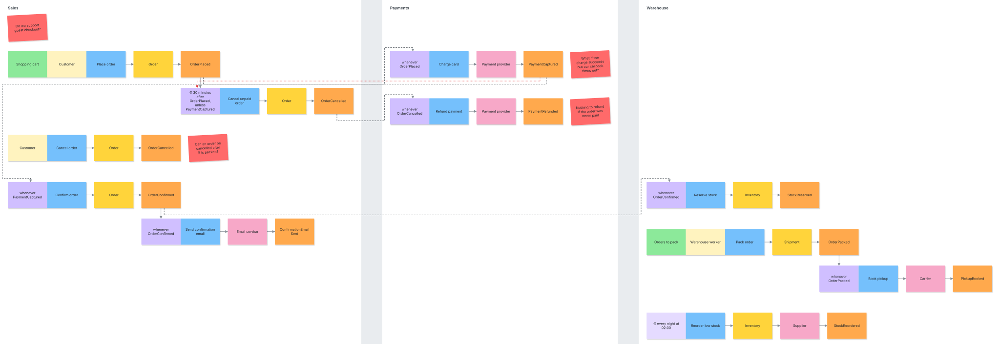

# estorm

Event Storming boards as plain text. Write the flow in a few readable lines
and get a board of stickies, rendered as SVG.

```
== Sales ==
{Shopping cart}
Customer: Place order -> (Order) -> OrderPlaced
  after 30 minutes unless PaymentCaptured
    then Cancel unpaid order -> (Order) -> OrderCancelled

== Payments ==
when OrderPlaced
  then Charge card -> [Payment provider] -> PaymentCaptured
  ! What if the charge succeeds but our callback times out?
```



Because boards are text, they live in your repository next to the code.
Changes go through review like any other change, show up as readable diffs,
and never go stale on a whiteboard photo.

## Notation at a glance

| Syntax                              | Sticky                                   |
| ----------------------------------- | ---------------------------------------- |
| `Event`                             | event, cause not known yet; a run of them is a timeline |
| `Actor: Command -> Event`           | actor, command, event                    |
| `-> (Aggregate) ->` / `-> [External] ->` | aggregate / external system         |
| `{Read model}`                      | read model, informing the next step      |
| `  then Command -> Event`           | policy reacting to the event above       |
| `  after 30 days unless Event`      | delayed policy, cancelled by an event    |
| `every night at 02:00: Command -> Event` | flow driven by a schedule           |
| `when Event`                        | policy reacting to an event by name      |
| `== Context ==`                     | bounded context, drawn as a lane         |
| `! Question?`                       | hotspot                                  |
| `# comment`                         | ignored                                  |

The full notation, with every rule and error message, is in
[GRAMMAR.md](GRAMMAR.md). More examples are in [examples/](examples/).

## Use it

### In the browser: nothing to install

Download `estorm.html` from the
[latest release](https://github.com/ville6000/estorm/releases/latest) and
open it. It is a single self-contained file that works offline: edit on the
left, see the board on the right, click a sticky to jump to its line, open
and save `.estorm` files, and export SVG.

It is also hosted at <https://ville6000.github.io/estorm/>, updated on
each release.

To share it with your teams, put the file on any static web server, an
intranet page or a file share.

### On the command line

Requires Node.js 22.18 or later.

```sh
npx estorm render board.estorm          # writes board.svg
npx estorm render docs/*.estorm         # one SVG next to each file
npx estorm render board.estorm -o -     # SVG to stdout
npx estorm check docs/*.estorm          # errors only, for CI
npx estorm serve board.estorm           # live preview at http://localhost:8080
```

Errors are reported as `file:line: message`, and the exit code is non-zero.

### In Docker or CI

```sh
docker build -t estorm .
docker run --rm -v "$PWD:/work" estorm render docs/board.estorm
```

For example, as a GitLab CI job that renders every board:

```yaml
boards:
  image: { name: registry.example.com/estorm:latest, entrypoint: [''] }
  script: estorm render $(find . -name '*.estorm' -not -path './node_modules/*')
  artifacts: { paths: ['**/*.svg'] }
```

### In your own code

```ts
import { parse, layout, svg, render, ParseError } from 'estorm';

const doc = render(text); // parse -> layout -> svg
```

## Running it without internet access

Everything estorm needs at runtime is in the repository: the browser editor
is one HTML file with no external requests, and the CLI has no runtime
dependencies. To use it in an offline or on-premises environment:

- **Editor:** host `estorm.html` on an internal web server or file share.
- **CI:** build the Docker image and push it to your internal registry.
- **CLI:** install from your npm mirror, or copy `dist/` and run
  `node dist/cli.js`.

## Development

```sh
npm install
npm run dev        # editor with hot reload
npm run check      # typecheck and tests
npm run build      # dist/ (library and CLI) and dist/web/estorm.html
npm run examples   # re-render examples/*.svg after a visual change
npm run estorm -- render board.estorm   # run the CLI from source
```

See [CONTRIBUTING.md](CONTRIBUTING.md) for how the code is organised and
how to propose notation changes.

## License

[MIT](LICENSE)
